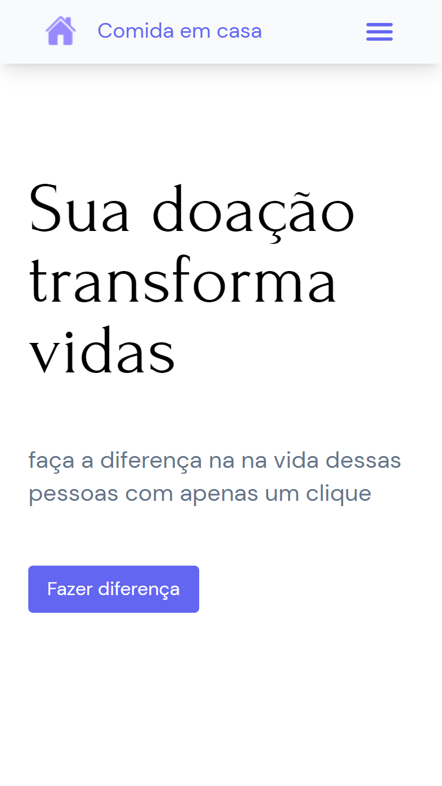
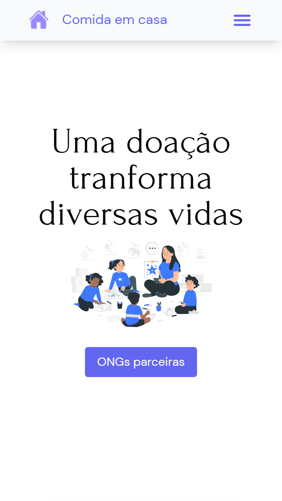
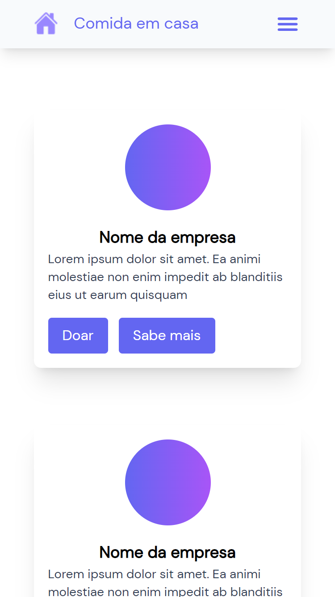
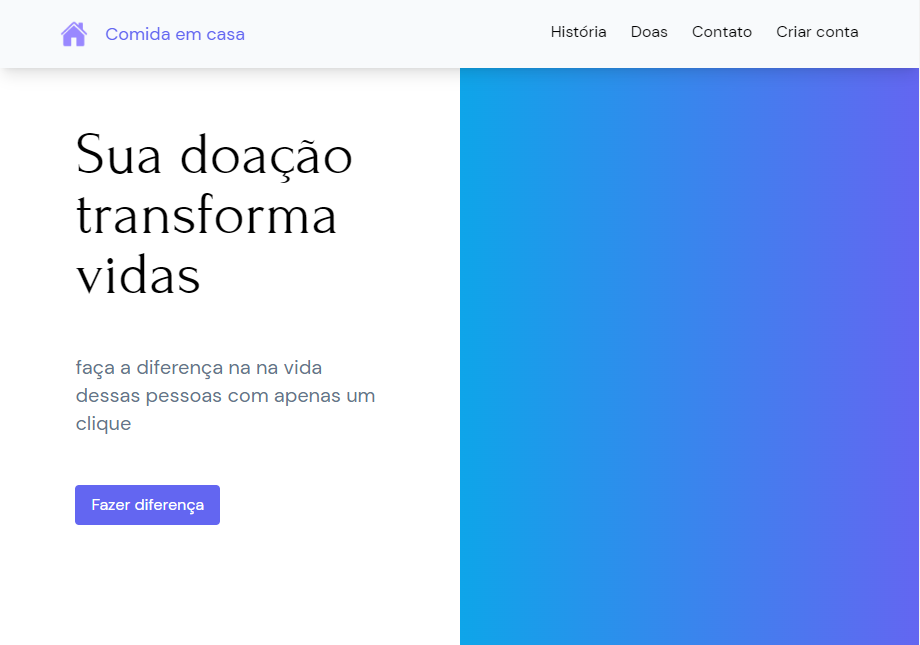

# Comida em casa

Sua transformação transforma vidas, dessa forma resolvemos trazer uma plataforma que pode ajudar a conetar doadores e instituições.

  
  
  
  

## Por que a internet é importante para as ONGs?

Quando se fala em ONGs, é muito comum se generalizar o conceito e as necessidades do setor inteiro, pensando em doações e voluntariado, somente. Na verdade, elas precisam de um plano de atuação estruturado e a divulgação entra como chave na estratégia, pois elas devem ser conhecidas pelo segmento que pretendem auxiliar, por possíveis colaboradores e pela sociedade civil. Esse movimento, que engloba conhecimento, ajuda e procura, resulta na captação de recursos.
As instituições do Terceiro Setor têm uma cultura de relacionamento direto muito forte, seja pelo uso de captadores na rua ou por ligações — e a internet ainda aparece como uma incógnita. É nesse ambiente que, quanto mais preparadas e presentes elas estiverem nas redes, mais eficaz serão os resultados revertidos para seus projetos.

